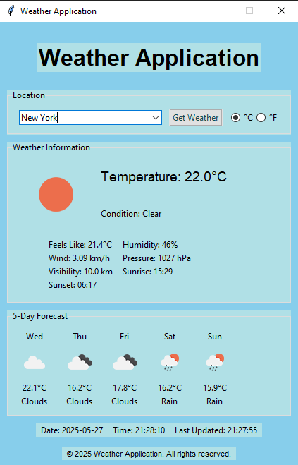

# 🌤️ Weather Application

A Python desktop GUI application that displays real-time weather data and a 5-day forecast for any city in the world. Built with **Tkinter** and powered by the **Open-Meteo API** — completely free, no API key required.

---

## Screenshots

<p align="center">
  
  &nbsp;&nbsp;
  
</p>

---

## Features

- **Real-time weather data** — current temperature, condition, feels-like, humidity, wind speed, atmospheric pressure, visibility, sunrise & sunset times
- **5-day forecast** — daily average temperature and weather condition with emoji icons
- **Dynamic theming** — the UI background animates and changes colour to match the current weather condition (sunny, rainy, snowy, stormy, etc.)
- **°C / °F toggle** — switch temperature units at any time without re-fetching data
- **Search history** — previously searched cities are remembered in the dropdown
- **Excel logging** — every weather query is automatically appended to `data/weather_log.xlsx` for later review
- **Live clock** — date and time update every second inside the app
- **No API key needed** — uses the fully free [Open-Meteo](https://open-meteo.com) API

---

## Tech Stack

| Layer         | Technology                                          |
| ------------- | --------------------------------------------------- |
| GUI           | Python `tkinter` / `ttk`                            |
| Weather API   | [Open-Meteo](https://open-meteo.com) (free, no key) |
| Geocoding API | Open-Meteo Geocoding                                |
| HTTP client   | `requests`                                          |
| Data logging  | `pandas` + `openpyxl`                               |
| Runtime       | Python 3.8+                                         |

---

## Project Structure

```
weather-application-main/
├── main.py               # Main application — WeatherApp class, all UI logic
├── background_manager.py # Dynamic colour theming & animated background transitions
├── requirements.txt      # Python dependencies
├── data/
│   └── weather_log.xlsx  # Auto-generated weather search log (created on first run)
└── sc/
    ├── sc_1.png          # Screenshot 1
    └── sc_2.png          # Screenshot 2
```

---

## Getting Started

### Prerequisites

- Python 3.8 or higher
- `pip` package manager

### Installation

1. **Clone the repository**

   ```bash
   git clone https://github.com/your-username/weather-application.git
   cd weather-application
   ```

2. **Install dependencies**

   ```bash
   pip install -r requirements.txt
   ```

3. **Run the application**
   ```bash
   python main.py
   ```

> No `.env` file or API key setup is needed. The app works out of the box.

---

## Usage

1. Type any city name into the search box.
2. Press **Enter** or click **Get Weather**.
3. Current conditions and a 5-day forecast will appear instantly.
4. Use the **°C / °F** radio buttons to switch temperature units.
5. Previously searched cities appear in the dropdown for quick re-selection.
6. Each search is automatically saved to `data/weather_log.xlsx`.

---

## Dynamic Weather Themes

The UI background smoothly transitions between colour palettes depending on live weather conditions:

| Condition         | Background Colour     |
| ----------------- | --------------------- |
| Clear             | Sky blue              |
| Clouds            | Light steel blue      |
| Rain              | Steel blue            |
| Snow              | Alice blue            |
| Thunderstorm      | Dark slate blue       |
| Drizzle           | Cornflower blue       |
| Mist / Haze / Fog | Lavender / Light grey |

---

## Weather Data Details

The app uses **WMO weather codes** returned by Open-Meteo and maps them to human-readable conditions and emoji icons:

| Code  | Condition                    | Icon  |
| ----- | ---------------------------- | ----- |
| 0     | Clear                        | ☀️    |
| 1–2   | Mainly Clear / Partly Cloudy | 🌤️ ⛅ |
| 3     | Overcast                     | ☁️    |
| 45–48 | Foggy                        | 🌫️    |
| 51–55 | Drizzle                      | 🌦️    |
| 61–65 | Rain                         | 🌧️    |
| 71–77 | Snow                         | 🌨️ ❄️ |
| 80–82 | Showers                      | 🌦️ ⛈️ |
| 95–99 | Thunderstorm                 | ⛈️    |

---

## Dependencies

```
requests==2.31.0
pandas==2.1.0
openpyxl==3.1.2
python-dateutil==2.8.2
numpy==1.24.3
```

Install all at once:

```bash
pip install -r requirements.txt
```

---

## API Reference

This application uses the **Open-Meteo** free weather API — no registration or API key required.

- **Geocoding:** `https://geocoding-api.open-meteo.com/v1/search`
- **Weather forecast:** `https://api.open-meteo.com/v1/forecast`

Full documentation: [https://open-meteo.com/en/docs](https://open-meteo.com/en/docs)

---

## License

This project is open source and available under the [MIT License](LICENSE).

---

## Acknowledgements

- [Open-Meteo](https://open-meteo.com) for providing a completely free and open weather API
- Python `tkinter` community for UI reference and styling patterns
